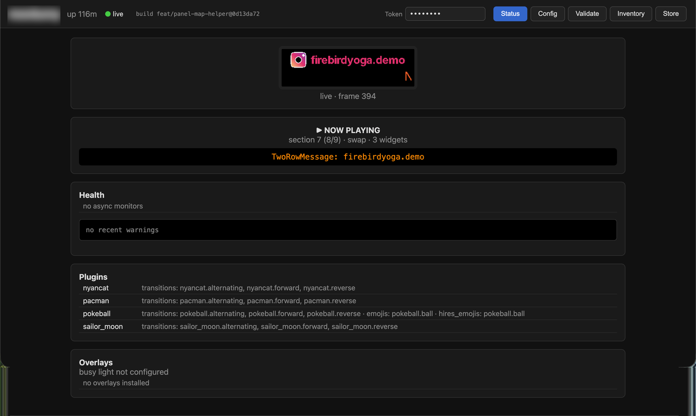

# led-ticker

[](https://github.com/JamesAwesome/led-ticker/actions/workflows/ci.yml)
[](LICENSE)


**led-ticker** is an open-source Python toolkit that drives RGB LED matrix panels — storefront marquees, gym and class schedules, sports scores, transit times, scrolling messages — from a Raspberry Pi, all from a single TOML config. Try it on your laptop with **no hardware** in about two minutes, then deploy the same Docker image to a Pi when your panels arrive.

A capability that sets led-ticker apart: **inline [value tokens](https://docs.ledticker.dev/concepts/value-tokens/)** — drop a `:weather.nyc:` or `:clock.now:` token into any widget's text and it resolves to a live, self-updating value. A single scrolling message can read `NYC: 72°F Sunny · 9:01 AM`, each piece refreshing on its own — live data composes into ordinary text instead of being locked to dedicated widgets.

Two reference builds share one codebase and one image:

- **Smallsign** — Pi 4 + 5× chained 16×32 panels = 160×16 logical canvas
- **Bigsign** — Pi 5 + 8× P3 32×64 panels in a 2×4 vertical-serpentine layout = 256×64 canvas

New to LED signs? [Why led-ticker?](https://docs.ledticker.dev/why-led-ticker/) covers when a Raspberry Pi HUB75 sign is the right tool — and when WLED, Tidbyt, or an ESP32 clock fits better.

Full documentation: <https://docs.ledticker.dev>

## Showcase

A few of the things a config can put on the wall — every cell links to the page that explains it:

| | | |
|:---:|:---:|:---:|
| [](https://docs.ledticker.dev/widgets/two_row/) | [](https://docs.ledticker.dev/assets/emoji/) | [](https://docs.ledticker.dev/concepts/fonts/) |
| Held top + scrolling bottom | Inline emoji — curated set + ~1,360 standard emoji (🚀 or `:rocket:`) on hires signs | Hi-res fonts |
| [](https://docs.ledticker.dev/transitions/) | [](https://docs.ledticker.dev/concepts/borders/) | [](https://docs.ledticker.dev/concepts/animations/) |
| Sprite-trail transitions | Animated borders | Animations + color providers |

## Quick start — no hardware required

No panel, no Pi. With [Docker](https://docs.docker.com/get-docker/) installed:

```bash
git clone https://github.com/JamesAwesome/led-ticker.git
cd led-ticker
make try
```

`make try` builds the image and starts a headless display engine plus the web UI — no panel, no Pi. Open **<http://localhost:8080>** and click the **live preview** tab to watch the sign rendering in your browser. By default it runs the bundled demo (`config/config.try.example.toml`); create `config/config.toml` and `make try` previews your own config instead, hot-reloading as you edit. To stop: press `Ctrl-C`, then run `make try-down`.

**Ready for hardware?** The [Getting started guide](https://docs.ledticker.dev/getting-started/) walks the full Raspberry Pi deploy end to end (`make setup` → `docker compose up -d`), and [building your own](https://docs.ledticker.dev/hardware/building-your-own/) covers the physical build — BOM, wiring, and panel tuning.

## Configuration

Everything is configured via a TOML file. Three reference configs ship in `config/`:

- `config.example.toml` — smallsign starter (160×16)
- `config.bigsign.example.toml` — bigsign with `pixel_mapper_config`, scaling, RP1 tuning (256×64)
- `config.firebird.example.toml` — realistic bigsign storefront layout (Firebird Yoga)

Pre-flight any config before deploying:

```bash
make validate CONFIG=config/config.toml
```

`led-ticker validate` checks the config against a registry of decision rules — bad font sizes, scroll-mode + stretch collisions, content-height overflow. It exits non-zero on errors, so it's handy in CI. Full output format: <https://docs.ledticker.dev/tools/validate/>.

Full config reference: <https://docs.ledticker.dev/reference/config-options/>. Per-widget pages document every knob: <https://docs.ledticker.dev/widgets/>.

## Plugins

The display engine ships on PyPI as **`led-ticker-core`** (`pip install led-ticker-core`); extra widgets and other extension points install separately as **plugins** that register themselves at startup. The first-party plugins live in the **[led-ticker-plugins](https://github.com/JamesAwesome/led-ticker-plugins)** monorepo — one package each, each with its own README. Declare the ones you want in a pip-requirements file:

```bash
cp config/requirements-plugins.example.txt config/requirements-plugins.txt
# edit to add/remove plugins, then restart (no image rebuild needed):
docker compose restart
```

The live `config/requirements-plugins.txt` is gitignored (it's yours to customize); the tracked `.example` lists all the first-party plugins (pool, baseball, crypto, calendar, RSS, weather, and the flair transitions) as a starting point — trim it to what your sign uses. Installed plugins auto-register via their `led_ticker.plugins` entry point — no `[plugins]` config change needed.

First-party data plugins are on PyPI — add them by name:

| Plugin | PyPI package | Widget types |
|--------|-------------|--------------|
| Pool | `led-ticker-pool` | `pool.monitor` |
| Baseball / MLB | `led-ticker-baseball` | `baseball.scores`, `.standings`, `.promotions`, `.statcast`, `.attendance` |
| CoinGecko crypto | `led-ticker-crypto` | `crypto.coingecko` |
| Calendar (.ics) | `led-ticker-calendar` | `calendar.events` |
| RSS/Atom feeds | `led-ticker-rss` | `rss.feed` |
| Weather | `led-ticker-weather` | `weather.current` |

The flair sprite-trail transitions (`nyancat`, `pokeball`, `pacman`, `sailor_moon`) ship together on PyPI as **`led-ticker-flair`** — one install adds all four (`transition = "nyancat.forward"` etc.) plus the `:pokeball.ball:` emoji.

Browse the first-party plugins in the [led-ticker-plugins](https://github.com/JamesAwesome/led-ticker-plugins) monorepo — they double as worked examples. Building your own? The [plugin authoring guide](https://docs.ledticker.dev/plugins/) walks you through shipping it as a standalone package in your own repo — no fork, no monorepo PR needed.

## Development

Working on led-ticker itself? Run it from a clone — no Docker, no hardware:

```bash
make dev        # Install deps (requires uv)
make test       # Run tests (no Docker needed; uses test stubs for rgbmatrix)
make lint       # Run ruff linter
make format     # Auto-format code
make validate CONFIG=config/config.toml  # Pre-flight a config
```

Tests use a stub `rgbmatrix` package so they run on any machine — no Raspberry Pi or Docker required. ~1450 tests, ~2 min on a laptop.

New contributors: start with [CONTRIBUTING.md](CONTRIBUTING.md) (setup, the change flow, where things live). `CLAUDE.md` holds the load-bearing invariants — the hardware-rendering constraints and per-subsystem rules — and has the step-by-step recipes for adding a widget or transition + the test-stub canvas contract.

## Deployment

### Docker on Raspberry Pi

```bash
make setup
```

The compose file mounts `./config` read-only into the container; edit TOML on the host and the running display hot-reloads most changes live (widgets, sections, schedule, brightness) — a restart is needed only for hardware-level fields like the panel chain or scaling.

### Web UI (optional)

An optional sidecar serves a read-only status dashboard (live preview, monitors, plugins, inventory) plus a token-gated config editor. Enable it with the `webui` compose profile — `COMPOSE_PROFILES=webui make up`. Details: <https://docs.ledticker.dev/concepts/web-status-ui/>.



The header shows the deployed build (`build <branch>@<sha>`). Use `make update` to rebuild the image (with a real version baked in) and recreate the running services. The webui sidecar is included when you've enabled the `webui` profile (e.g. `COMPOSE_PROFILES=webui` in `.env`).

The compose file's `restart: unless-stopped` policy handles auto-restart on crash and on Pi reboot. Full deploy walkthrough: <https://docs.ledticker.dev/hardware/building-your-own/>.

## Hardware

The single Docker image detects the SoC at runtime and selects the BCM2711 GPIO backend (Pi 4) or the RP1 PIO/RIO backend (Pi 5). On the Pi 5 the RP1 RIO backend is the default; the runtime CLI accepts `--led-rp1-pio=1` to force the low-CPU PIO backend. For chain ≥ 2 with flicker raise `gpio_slowdown` from 2 to 3+.

Hardware reference (BOM, wiring, panel-tuning knobs): <https://docs.ledticker.dev/hardware/building-your-own/>.

### Hardware compatibility

led-ticker works with the same hardware as the underlying `jamesawesome/rpi-rgb-led-matrix` library (our fork of `hzeller/rpi-rgb-led-matrix`):

- **Controller boards:** Adafruit RGB Matrix HAT and RGB Matrix Bonnet (`hardware_mapping = "adafruit-hat"`). Other HUB75 wiring/GPIO mappings supported by the library also work.
- **Panels:** HUB75 RGB LED matrix panels — any pitch (P3, P4, P5, …). The reference builds use P3 32×64 and 16×32 panels; chains and serpentine layouts are configured in TOML.
- **Raspberry Pi:** Pi 4 (BCM2711 GPIO backend) and Pi 5 (RP1 PIO/RIO backend).

See the [hardware reference](https://docs.ledticker.dev/hardware/building-your-own/) for BOMs, wiring diagrams, and panel-tuning knobs.

### Calibration & diagnostics

Two deterministic helpers for the moment you power on a freshly wired sign and the output is blank, the wrong colors, or scrambled:

- **`panel-test`** (`make panel-test`) — paints the whole wall solid R → G → B → White → Black so you can rule out wiring, driver, and RGB-order problems before touching any TOML. [Docs](https://docs.ledticker.dev/tools/panel-test/)
- **`panel-map`** (`make panel-map-reveal` → photo → `derive` → `verify`) — when your panels are chained in a serpentine layout and text comes out mirrored or scrambled, this derives the `pixel_mapper_config` "Remap" string for you instead of hand-iterating with random text. [Docs](https://docs.ledticker.dev/tools/panel-map/)

## Community

- **Questions, ideas, show-and-tell:** [GitHub Discussions](https://github.com/JamesAwesome/led-ticker/discussions)
- **Bugs & feature requests:** [Issues](https://github.com/JamesAwesome/led-ticker/issues)
- **Contributing:** [CONTRIBUTING.md](CONTRIBUTING.md)
- **Build a plugin:** the [authoring guide](https://docs.ledticker.dev/plugins/) — ship a standalone plugin in your own repo, no fork needed
- **Be excellent to each other:** [Code of Conduct](CODE_OF_CONDUCT.md)
- **Security:** report privately — see [SECURITY.md](SECURITY.md)
- **General contact:** hello@ledticker.dev

## Origins & transparency

led-ticker began as an original asyncio LED-ticker library written by James Awesome, and was developed further with the use of Claude AI.

## License

[MIT](LICENSE) © James Awesome
